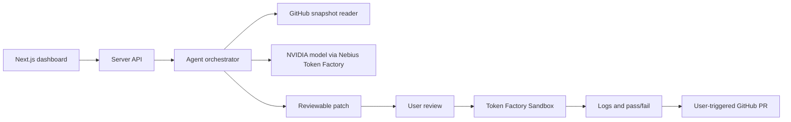

# AI DevOps Engineer

A Nebius × NVIDIA Global AI Hackathon project that helps developers understand and repair failed builds. Paste a GitHub repository URL, receive evidence-backed findings, review a proposed patch, verify it in an isolated sandbox, and open a pull request.

**Status: runnable Next.js starter.** The landing page and `/api/health` work without credentials. Live repository analysis, NVIDIA inference, fix generation, sandbox execution, and PR creation are not implemented yet. Adapter interfaces and workstream notes define where they belong.

## Quick start

Requires Node.js 24 and npm.

```sh
git clone https://github.com/marsshark13/DEVOPSS-ENGINEER.git
cd DEVOPSS-ENGINEER
# While the starter PR is open:
git switch codex/hackathon-starter
npm ci
npm run dev
```

Open http://localhost:3000. Check http://localhost:3000/api/health for the starter health response. No environment file is required for this scaffold. For future integrations, copy `.env.example` to `.env.local` and fill values locally; never commit them. On PowerShell use `Copy-Item .env.example .env.local`; on macOS/Linux use `cp .env.example .env.local`.

```sh
npm run lint
npm run typecheck
npm run build
npm start
```

`npm run check` runs lint, type checking, and the production build. CI runs the same checks without secrets. Health reports web-app availability, not provider connectivity.

## Architecture



The diagram describes the target workflow. Keep provider credentials and adapters server-side. The GitHub adapter supplies a bounded snapshot pinned to a commit; the analyzer produces structured findings with file evidence. The fixer returns a patch against that same commit. The sandbox verifies the patch before the user requests a PR. Inference and code execution use separate adapters.

```text
app/                   App Router page, layout, styles, and health API
components/            Reusable dashboard UI
lib/agents/            Orchestration and analyzer contract
lib/nebius/            Server-only inference configuration
lib/github/            Repository reader contract
lib/sandbox/           Verification contract; no host execution
types/                 Shared snapshot, finding, patch, and run types
.github/               CI and PR template
.env.example           Empty server-side configuration placeholders
```

## Team: four workstreams

| Role | Ownership | First deliverable |
| --- | --- | --- |
| You — DevOps / Cloud Lead | `lib/nebius`, `lib/sandbox`, CI, integration | Real NVIDIA model call on Nebius; isolated build with captured logs |
| Member 2 — Agent Engineering | `lib/agents`, shared contracts | Evidence-backed analyzer and schema-validated findings |
| Member 3 — Backend / GitHub | `lib/github`, API routes | Bounded public repository snapshot pinned to a commit |
| Member 4 — Frontend / UX | `app`, `components` | Repository form, findings, timeline, diff, and log views |

The lead coordinates interfaces, reviews integration PRs, and owns the demo. Workstreams have dedicated `codex/devops-nebius`, `codex/agent-engineering`, `codex/backend-github`, and `codex/frontend-ux` branches; use focused PRs as described in [CONTRIBUTING.md](CONTRIBUTING.md). Agree on shared types before parallel implementation.

## MVP and delivery order

1. **Analyze:** GitHub URL → fetch selected `package.json`, Dockerfile, CI and build configuration → real NVIDIA/Nebius analysis → display severity, evidence, reason, and recommendation. Handle invalid URLs, missing files, rate limits, model errors, and empty findings.
2. **Fix and verify:** select a finding → generate and review a diff → execute in Token Factory Sandbox → show commands, redacted logs, duration, and pass/fail. Start with one supported Node.js project type and a deliberately broken demo fixture.
3. **PR:** after successful verification and user action, create a new branch and PR with the patch, explanation, and verification evidence. Detect a changed base commit and require re-verification.

Analysis is the first integration milestone; the coding-track submission must also demonstrate writing, running, and testing code. Multi-language support, automatic deployment, production credentials, and unattended merging are out of scope for the first demo.

## Hackathon checklist

Based on the [official rules](https://nebiusglobalaihackathon.devpost.com/rules), checked September 12, 2026; recheck before submission.

- [ ] Target **Coding and Agentic Engineering**: demonstrate agents writing, running, and testing code in Token Factory Sandboxes.
- [ ] Use at least one NVIDIA open-source model and a runtime Token Factory inference call or Nebius AI Cloud compute. Record the exact model and integration evidence.
- [ ] Submit by **October 30, 2026, 10:00 a.m. Pacific Time**.
- [ ] Supply a working demo/test URL, public source, setup instructions, and an open-source license. This starter proposes MIT for review in the PR.
- [ ] Provide an English project description and public YouTube demo under three minutes; show actual functionality and explain Nebius/NVIDIA use.
- [ ] Select the track, provide tool feedback, and describe significant in-period updates if applicable.
- [ ] Keep the working project available to judges through the judging period; review full eligibility and submission terms with the team.

Suggested demo: show a broken build, inspect evidence, review a generated diff, run verification, then open a PR. Capture before/after logs and discuss limitations. Do not present fixture output as a live model result.

## Configuration and safety

`NEBIUS_API_KEY`, `NEBIUS_BASE_URL`, and `NEBIUS_MODEL` are reserved for inference. Obtain current endpoint/model values from your Nebius console. `GITHUB_TOKEN` and `SANDBOX_API_KEY` are optional placeholders for future adapters; their presence does not enable features. No credentials are included.

Treat repository files and model responses as untrusted data. Validate schemas and paths, bound context and retries, redact logs, and use least-privilege credentials. Execute external code only in disposable sandboxes with resource limits and cleanup. Never expose server secrets through `NEXT_PUBLIC_` or commit `.env.local`.

## License

MIT — see [LICENSE](LICENSE).
